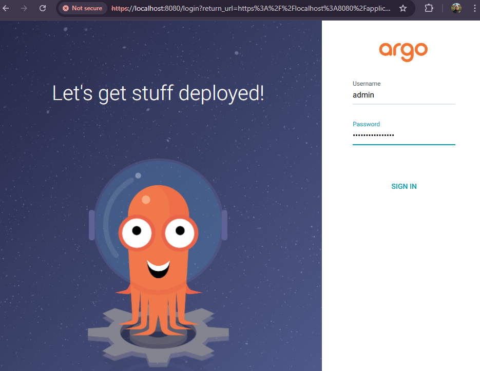
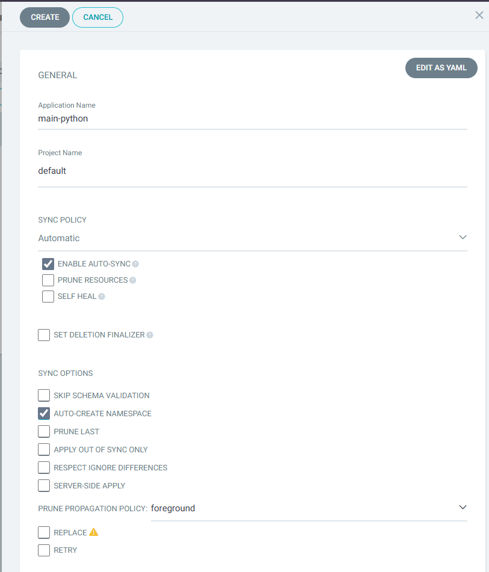
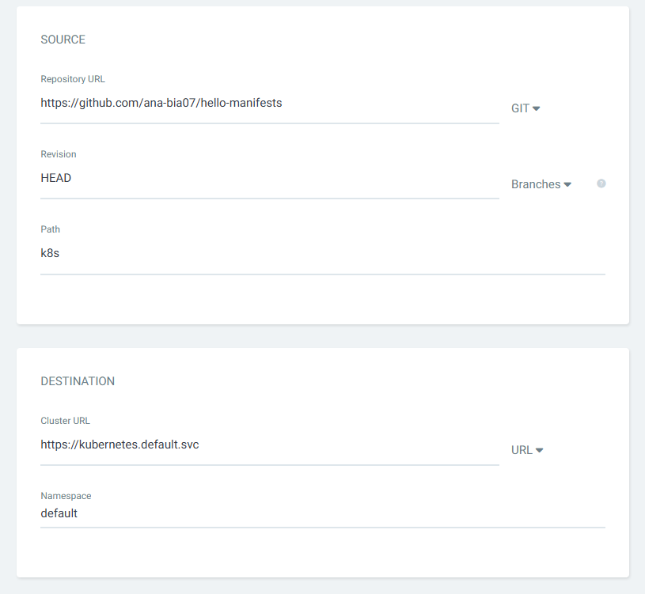
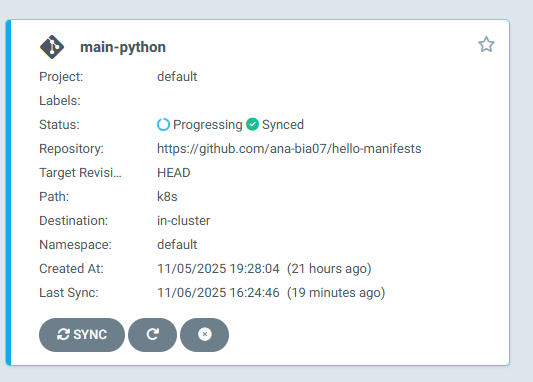
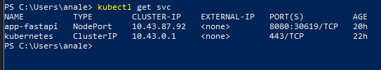
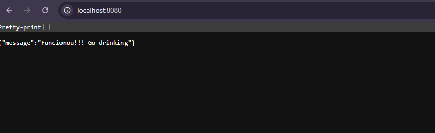
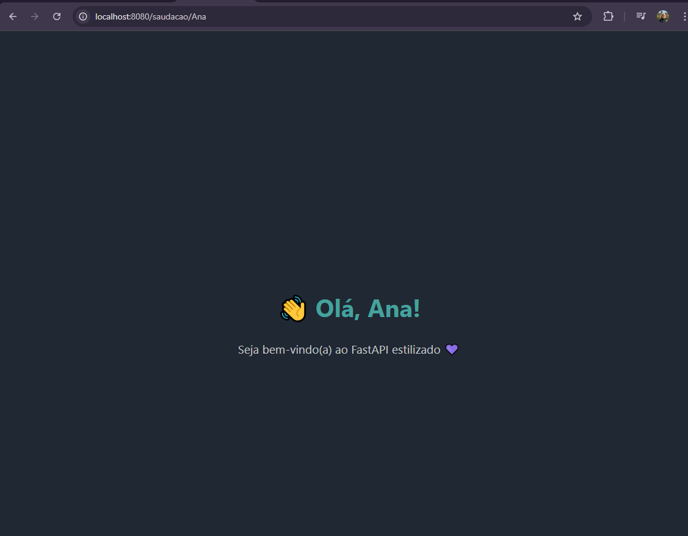

# Hello - Manifests

Esse repositorio tem como função de armazenar os manifestos, mais especificamente de Deploy e Service, que esta sendo usado no projeto GitActions: [Link para Repositorio](https://github.com/ana-bia07/Projeto-GitActions). Caso tenha interesse de utilizar pode consultar a documentação.

## Requisitos
- ArgoCd
- Kubernetes configurado
- Cluster local (foi usado Rancher)

### 🚢 Configurando o Argo

No PowerShell, crie o namespace (lembre-se de manter o Rancher aberto em segundo plano):

```bash
kubectl create namespace argocd
```

Instale o ArgoCD:
```bash
kubectl apply -n argocd -f https://raw.githubusercontent.com/argoproj/argo-cd/stable/manifests/install.yaml
```

Verifique a instalação:
```bash
kubectl get svc -n argocd
```

Crie um túnel temporário com:
```bash
kubectl port-forward svc/argocd-server -n argocd 8080:443
```

Em outro terminal (mantenha o anterior aberto), pegue a senha para login:

```bash
[System.Text.Encoding]::UTF8.GetString([System.Convert]::FromBase64String($(kubectl get secret argocd-initial-admin-secret -n argocd -o jsonpath="{.data.password}")))
```

Acesse: [http://localhost:8080](http://localhost:8080)  
Usuário: `admin`  
Senha: cole a senha exibida no terminal  



### Crie uma aplicação com o repositório 
  
  


Aguarde até **10 minutos**, pois pode demorar.  
Depois, execute novamente:
```bash
kubectl get svc
```



Interrompa o terminal anterior (`Ctrl + C`) e execute:
```bash
kubectl port-forward svc/app-fastapi 8080:8080
```

Acesse [http://localhost:8080](http://localhost:8080)  
  

Acessando http://localhost:8080/saudacao/{nome}

